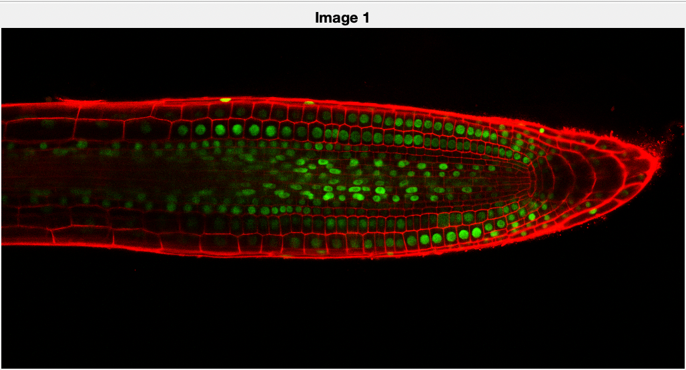
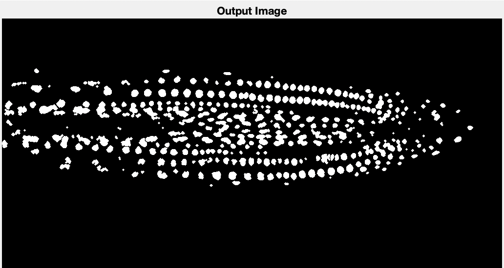
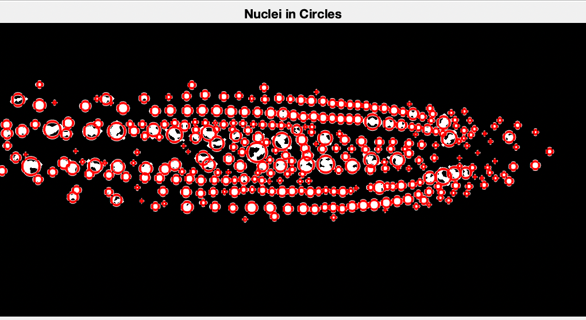
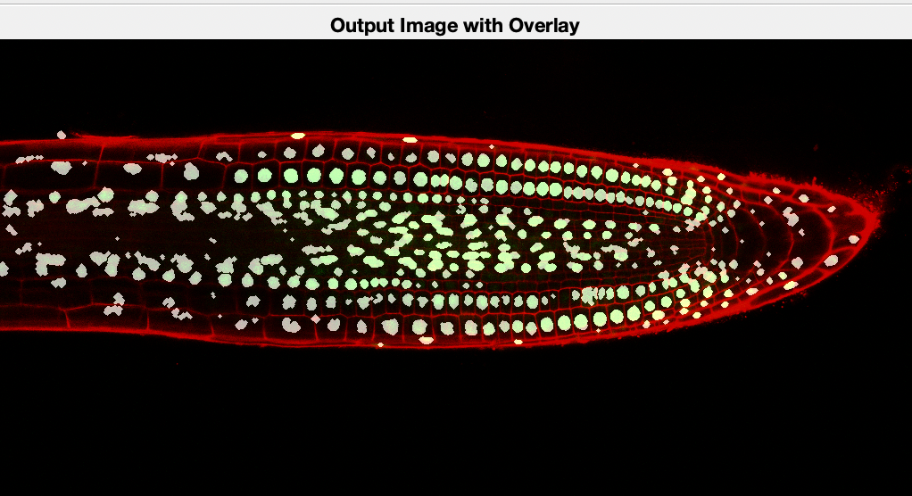

# Nuclei Counting

### Function: solution.m

**Input**: Image (StackNinja1.bmp/StackNinja3.bmp/StackNinja3.bmp)
**Output**: Image (binary image corresponding to the nuclei)
        nr (number of nuclei detected)
        config (a structure containing size, shapes, brightness and others)

## Images Example:
  
  

  

  

  


## Requirements
- Matlab Image Processing Tool

## To run
1) Run ```script.m``` in Matlab

2) While running, the intermediate results for each image will be shown.

3) The config structure contains:
   - size (distribution, max, min and average)
   - shape (circularity, centers, radii)
   - brightness (distribution, max, min and average)


4) To get the data of config, use dot operator
   Example to get the max size of the nucleus in the image:
   - config.areas.max

### More info available in https://github.com/joewong00/Nuclei-Segmentation.wiki.git
